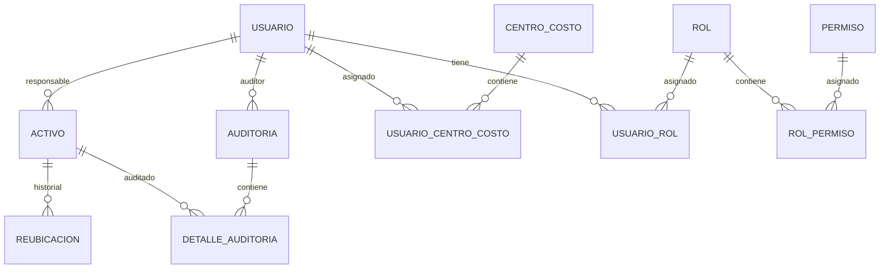

# ?? Sistema de Gestión de Activos Empresariales

API REST para la gestión integral de activos empresariales con soporte para auditorías, reubicaciones y control de permisos basado en centros de costo.


---

## ?? Tabla de Contenidos

- [Características Principales](#-características-principales)
- [Arquitectura](#?-arquitectura)
- [Tecnologías](#-tecnologías)
- [Estructura del Proyecto](#-estructura-del-proyecto)
- [Instalación](#-instalación)
- [Configuración](#?-configuración)
- [Endpoints Principales](#-endpoints-principales)
- [Modelo de Datos](#-modelo-de-datos)
- [Sistema de Permisos](#-sistema-de-permisos)
- [Ejemplos de Uso](#-ejemplos-de-uso)
- [Contribución](#-contribución)
- [Licencia](#-licencia)

---

## ?? Características Principales

### ?? Gestión de Activos
- ? CRUD completo de activos empresariales
- ? Historial de reubicaciones por activo
- ? Asignación de responsables
- ? Carga de imágenes y documentos (MinIO)
- ? Categorización de activos
- ? Estados: Activo, Inactivo, En Reparación

### ?? Gestión de Usuarios
- ? Autenticación con login
- ? Roles y permisos granulares
- ? Acceso multi centro de costo
- ? Agrupación dinámica por centro de costo

### ?? Sistema de Auditorías
- ? Auditorías Auto y Externas
- ? Configuración de períodos de auditoría
- ? Estado de auditoría por usuario
- ? Detalles por activo auditado
- ? Historial completo de auditorías

### ?? Transferencias y Reubicaciones
- ? Solicitudes de transferencia
- ? Aprobación/Rechazo de solicitudes
- ? Historial de movimientos
- ? Notificaciones automáticas

### ?? Centros de Costo
- ? Gestión multi centro de costo
- ? Asignación temporal o permanente
- ? Agrupación dinámica: `RazonSocial_Ubicacion_Area`
- ? Filtrado de datos por acceso

### ?? Seguridad
- ? Control de acceso basado en roles (RBAC)
- ? Permisos granulares por funcionalidad
- ? Filtrado automático por centros accesibles
- ? Validación de headers personalizados

---

## ??? Arquitectura

El proyecto sigue **Clean Architecture** con una clara separación de responsabilidades:

```
GestionActivosApi/
??? ?? GestionActivos.Domain          # Entidades y reglas de negocio
??? ?? GestionActivos.Application     # Casos de uso (CQRS)
??? ??? GestionActivos.Infrastructure  # Persistencia y servicios externos
??? ?? GestionActivos.API             # Controllers y middlewares
```

### Patrones Implementados

- **Clean Architecture**: Separación en capas con dependencias hacia el dominio
- **CQRS**: Separación de comandos y consultas con MediatR
- **Repository Pattern**: Abstracción del acceso a datos
- **Unit of Work**: Transacciones coordinadas
- **Dependency Injection**: Inyección de dependencias nativa de .NET
- **DTO Pattern**: Transferencia de datos sin exponer entidades

---

## ?? Tecnologías

### Backend
- **.NET 8** - Framework principal
- **C# 12** - Lenguaje de programación
- **Entity Framework Core 8** - ORM
- **MediatR** - Implementación de CQRS
- **FluentValidation** - Validación de datos
- **AutoMapper** - Mapeo de objetos
- **Serilog** - Logging estructurado

### Base de Datos
- **SQL Server** - Base de datos relacional
- **EF Core Migrations** - Control de versiones de BD

### Almacenamiento
- **MinIO** - Almacenamiento de archivos (S3 compatible)

### Herramientas de Desarrollo
- **Swagger/OpenAPI** - Documentación de API
- **Git** - Control de versiones

---

## ?? Estructura del Proyecto

```
GestionActivosApi/
?
??? ?? GestionActivos.Domain/
?   ??? Entities/                  # Entidades del dominio
?   ?   ??? Usuario.cs
?   ?   ??? Activo.cs
?   ?   ??? Auditoria.cs
?   ?   ??? CentroCosto.cs
?   ?   ??? Reubicacion.cs
?   ?   ??? ...
?   ??? Interfaces/                # Contratos de repositorios
?   ?   ??? IUsuarioRepository.cs
?   ?   ??? IActivoRepository.cs
?   ?   ??? UnitsOfWork/
?   ??? Exceptions/                # Excepciones personalizadas
?
??? ?? GestionActivos.Application/
?   ??? UsuarioApplication/
?   ?   ??? Commands/              # Comandos (escritura)
?   ?   ??? Queries/               # Consultas (lectura)
?   ?   ??? Handlers/              # Manejadores CQRS
?   ?   ??? DTOs/                  # Objetos de transferencia
?   ?   ??? Validators/            # Validaciones FluentValidation
?   ??? ActivoApplication/
?   ??? AuditoriaApplication/
?   ??? SolicitudApplication/
?   ??? ReubicacionApplication/
?   ??? Behaviors/                 # Pipelines de MediatR
?
??? ??? GestionActivos.Infrastructure/
?   ??? Persistence/
?   ?   ??? ApplicationDbContext.cs
?   ?   ??? Configurations/        # Configuraciones EF Core
?   ??? Repositories/              # Implementaciones de repositorios
?   ??? UnitsOfWork/               # Unidades de trabajo
?   ??? Services/                  # Servicios externos (MinIO)
?   ??? Migrations/                # Migraciones de BD
?
??? ?? GestionActivos.API/
    ??? Controllers/               # Endpoints REST
    ?   ??? AuthController.cs
    ?   ??? UsuarioController.cs
    ?   ??? ActivoController.cs
    ?   ??? AuditoriasController.cs
    ?   ??? ...
    ??? Middleware/                # Middleware personalizado
    ??? Filters/                   # Filtros de Swagger
    ??? Extensions/                # Métodos de extensión
    ??? Program.cs                 # Configuración de la app
```

---

## ?? Instalación

### Prerrequisitos

- [.NET 8 SDK](https://dotnet.microsoft.com/download/dotnet/8.0)
- [SQL Server 2019+](https://www.microsoft.com/sql-server) o SQL Server Express
- [MinIO](https://min.io/download) (opcional, para almacenamiento de archivos)
- [Git](https://git-scm.com/)

### Pasos de Instalación

1. **Clonar el repositorio**
```bash
git clone https://github.com/EddieToledoE/GestionActivosApi.git
cd GestionActivosApi
```

2. **Restaurar paquetes NuGet**
```bash
dotnet restore
```

3. **Configurar la cadena de conexión**

Edita `appsettings.json` en el proyecto `GestionActivos.API`:

```json
{
  "ConnectionStrings": {
    "DefaultConnection": "Server=localhost;Database=GestionActivosDb;Trusted_Connection=True;TrustServerCertificate=True;"
  },
  "Minio": {
    "Endpoint": "localhost:9000",
    "AccessKey": "minioadmin",
    "SecretKey": "minioadmin",
    "BucketName": "activos-bucket",
    "UseSSL": false
  }
}
```

4. **Aplicar migraciones** (Opcional - se aplica automáticamente al iniciar)
```bash
cd GestionActivos.Infrastructure
dotnet ef database update --startup-project ../GestionActivosApi
```

5. **Ejecutar la aplicación**
```bash
cd ../GestionActivosApi
dotnet run
```

6. **Acceder a Swagger**
```
https://localhost:5001/swagger
```

---

## ?? Configuración

### Variables de Entorno

Puedes usar variables de entorno para configuración en producción:

```bash
export ConnectionStrings__DefaultConnection="Server=prod-server;Database=GestionActivos;..."
export Minio__Endpoint="minio.empresa.com"
export Minio__AccessKey="access-key"
export Minio__SecretKey="secret-key"
```

### Migraciones Automáticas

El sistema detecta automáticamente el entorno:

- **Desarrollo**: Crea la base de datos con `EnsureCreated()`
- **Producción**: Aplica migraciones con `Migrate()`

```csharp
// Program.cs
if (app.Environment.IsDevelopment())
{
    dbContext.Database.EnsureCreated();
}
else
{
    dbContext.Database.Migrate();
}
```

---

## ?? Endpoints Principales

### ?? Autenticación

#### POST `/api/auth/login`
Login con credenciales. Retorna información completa del usuario con roles, permisos y centros de costo.

**Request:**
```json
{
  "correo": "usuario@empresa.com",
  "contrasena": "password123"
}
```

**Response:**
```json
{
  "idUsuario": "guid",
  "nombres": "Juan",
  "apellidoPaterno": "Pérez",
  "roles": [
    {
      "idRol": 1,
      "nombre": "Administrador",
      "permisos": ["Crear Usuarios", "Editar Usuarios", "..."]
    }
  ],
  "permisos": ["Crear Usuarios", "Editar Usuarios", "..."],
  "centrosCostoAcceso": [
    {
      "idCentroCosto": 1,
      "razonSocial": "Empresa SA",
      "ubicacion": "Planta Monterrey",
      "area": "Producción"
    }
  ]
}
```

---

### ?? Usuarios

#### GET `/api/usuario`
Obtiene usuarios agrupados por centro de costo. Requiere header `X-User-Id`.

**Headers:**
```
X-User-Id: guid-usuario
```

**Query Params:**
```
?search=nombre  (opcional)
```

**Response:**
```json
{
  "Empresa SA_Planta Monterrey_Producción": [
    {
      "idUsuario": "guid",
      "nombreCompleto": "Luis Eduardo Toledo Espinosa",
      "claveFortia": "223191",
      "correo": "teddy@empresa.com"
    }
  ],
  "Empresa SA_Oficina CDMX_Finanzas": [...]
}
```

---

### ?? Activos

#### GET `/api/activo`
Obtiene activos agrupados por centro de costo. Requiere header `X-User-Id` y permiso `Activos_Ver_Externos`.

**Response:**
```json
{
  "activos_Propios": [
    {
      "idActivo": "guid",
      "nombre": "Laptop Dell",
      "categoria": "Computación",
      "responsable": "Juan Pérez",
      "estado": "Activo",
      "etiqueta": "LAP-001"
    }
  ],
  "centrosCosto": {
    "Empresa SA_Planta Monterrey_Producción": [...]
  }
}
```

#### GET `/api/activo/{id}/historial`
Obtiene un activo con su historial completo de reubicaciones.

**Response:**
```json
{
  "idActivo": "guid",
  "nombre": "Laptop Dell",
  "responsableActual": "Carlos Ramírez",
  "centroCostoActual": "Empresa SA_Oficina CDMX_Finanzas",
  "historialReubicaciones": [
    {
      "fecha": "2024-11-15T10:30:00",
      "motivo": "Transferencia por cambio de área",
      "usuarioAnterior": "María López",
      "usuarioNuevo": "Carlos Ramírez"
    }
  ]
}
```

---

### ?? Auditorías

#### GET `/api/auditoria`
Obtiene auditorías agrupadas por centro de costo y tipo (Auto/Externa). Requiere permiso `Auditoria_Ver_Externos`.

**Response:**
```json
{
  "centrosCosto": {
    "Empresa SA_Planta Monterrey_Producción": {
      "auto": [
        {
          "idAuditoria": "guid",
          "fecha": "2024-11-21T10:30:00",
          "responsable": "Juan Pérez",
          "tipo": "Auto"
        }
      ],
      "externa": [...]
    }
  }
}
```

#### POST `/api/auditoria/registrar`
Registra una nueva auditoría con sus detalles.

**Request:**
```json
{
  "idAuditor": "guid-auditor",
  "idUsuarioAuditado": "guid-usuario",
  "observaciones": "Auditoría trimestral",
  "detalles": [
    {
      "idActivo": "guid-activo",
      "estado": "Conforme",
      "comentarios": "En buen estado"
    }
  ]
}
```

#### GET `/api/auditoria/{id}`
Obtiene una auditoría completa con todos sus detalles.

---

### ?? Solicitudes

#### POST `/api/solicitud`
Crea una solicitud de transferencia de activo.

#### GET `/api/solicitud/pendientes/receptor/{id}`
Obtiene solicitudes pendientes recibidas.

#### PUT `/api/solicitud/{id}/aceptar`
Acepta una solicitud de transferencia.

#### PUT `/api/solicitud/{id}/rechazar`
Rechaza una solicitud de transferencia.

---

### ?? Centros de Costo

#### GET `/api/usuario-centrocosto/{idUsuario}`
Obtiene centros de costo asignados a un usuario.

#### POST `/api/usuario-centrocosto`
Asigna un centro de costo a un usuario (o reactiva si existe inactivo).

#### DELETE `/api/usuario-centrocosto/{idUsuario}/{idCentroCosto}`
Desactiva la asignación de un centro de costo.

---

## ??? Modelo de Datos

### Entidades Principales



### Tablas Principales

- **CAT_USUARIO**: Usuarios del sistema
- **CAT_CENTRO_COSTO**: Centros de costo (RazonSocial, Ubicacion, Area)
- **MOV_ACTIVO**: Activos empresariales
- **MOV_AUDITORIA**: Auditorías realizadas
- **H_DETALLE_AUDITORIA**: Detalles de auditoría por activo
- **H_REUBICACION**: Historial de movimientos de activos
- **MOV_SOLICITUD**: Solicitudes de transferencia
- **MOV_USUARIO_CENTRO_COSTO**: Asignación de usuarios a centros (muchos a muchos)
- **MOV_USUARIO_ROL**: Roles de usuarios
- **CAT_ROL**: Catálogo de roles
- **CAT_PERMISO**: Catálogo de permisos
- **CAT_ROL_PERMISO**: Permisos por rol

---

## ?? Sistema de Permisos

### Estructura

```
Usuario ? Roles ? Permisos
Usuario ? Centros de Costo (acceso a datos)
```

### Permisos Disponibles

| Permiso | Descripción |
|---------|-------------|
| `Crear Usuarios` | Permite crear nuevos usuarios |
| `Editar Usuarios` | Permite modificar usuarios existentes |
| `Eliminar Usuarios` | Permite desactivar usuarios |
| `Activos_Ver_Externos` | Ver activos de otros centros de costo |
| `Auditoria_Ver_Externos` | Ver auditorías de otros centros de costo |
| `Gestionar Activos` | CRUD completo de activos |
| `Aprobar Solicitudes` | Aprobar/rechazar solicitudes de transferencia |

### Roles Típicos

1. **Administrador**: Todos los permisos
2. **Auditor**: Ver auditorías, crear auditorías
3. **Usuario**: Gestión básica de sus activos
4. **Supervisor**: Ver activos externos, aprobar solicitudes

---

## ?? Ejemplos de Uso

### Crear una Auditoría

```csharp
// 1. Login
var login = await client.PostAsync("/api/auth/login", new {
    correo = "auditor@empresa.com",
    contrasena = "password"
});

var userData = await login.Content.ReadAsAsync<LoginResponse>();

// 2. Registrar auditoría
var auditoria = new {
    idAuditor = userData.IdUsuario,
    idUsuarioAuditado = usuarioAuditadoId,
    observaciones = "Auditoría mensual",
    detalles = new[] {
        new { idActivo = activo1Id, estado = "Conforme", comentarios = "OK" },
        new { idActivo = activo2Id, estado = "No Conforme", comentarios = "Reparar" }
    }
};

await client.PostAsync("/api/auditoria/registrar", auditoria);
```

### Buscar Usuarios

```javascript
// Frontend - Búsqueda con debounce
const searchUsuarios = debounce(async (searchTerm) => {
  const response = await fetch(`/api/usuario?search=${searchTerm}`, {
    headers: {
      'X-User-Id': currentUserId
    }
  });
  
  const usuarios = await response.json();
  renderUsuarios(usuarios);
}, 300);
```

### Aprobar Transferencia

```csharp
// Aprobar solicitud
await client.PutAsync($"/api/solicitud/{solicitudId}/aceptar", new {
    idUsuarioAprobador = aprobadorId
});

// El sistema automáticamente:
// 1. Actualiza el responsable del activo
// 2. Registra en historial de reubicaciones
// 3. Envía notificación al emisor
```

---

## ?? Características Especiales

### Agrupación Dinámica por Centro de Costo

Formato: `RazonSocial_Ubicacion_Area`

**Ventaja**: Diferencia entre áreas de la misma empresa/ubicación.

```
Empresa SA_Planta Monterrey_Producción
Empresa SA_Planta Monterrey_Administración
Empresa SA_Planta Monterrey_Almacén
```

### Reactivación Automática

Al asignar un centro de costo previamente desactivado, se reactiva automáticamente en lugar de generar error de clave duplicada.

### Inferencia de Centro de Costo

Al crear auditorías, el centro de costo se obtiene automáticamente del usuario auditado para mantener integridad histórica.

---

## ?? Testing

```bash
# Ejecutar tests unitarios
dotnet test

# Con cobertura
dotnet test /p:CollectCoverage=true
```

---

## ?? Logging

El sistema usa **Serilog** para logging estructurado:

- **Console**: Logs en desarrollo
- **File**: `logs/app-{Date}.log` con rotación diaria
- **Nivel mínimo**: Information

```csharp
Log.Information("Usuario {UserId} creó activo {ActivoId}", userId, activoId);
```

---

## ?? Manejo de Errores

### ProblemDetails (RFC 7807)

Todas las respuestas de error siguen el estándar **ProblemDetails**:

```json
{
  "type": "https://tools.ietf.org/html/rfc7231#section-6.5.1",
  "title": "Error de validación",
  "status": 400,
  "detail": "El correo electrónico es obligatorio.",
  "instance": "/api/usuario",
  "traceId": "00-abc123...",
  "errors": {
    "Correo": ["El correo electrónico es obligatorio."]
  }
}
```

### Excepciones Personalizadas

- `NotFoundException` ? 404
- `ValidationException` ? 400
- `BusinessException` ? 400
- `UnauthorizedAccessException` ? 401

---

## ?? Despliegue

### Docker (Próximamente)

```bash
docker build -t gestion-activos-api .
docker run -p 5000:80 gestion-activos-api
```

### IIS

1. Publicar la aplicación:
```bash
dotnet publish -c Release -o ./publish
```

2. Configurar pool de aplicaciones para .NET Core
3. Apuntar el sitio web a la carpeta `publish`

---

## ?? Contribución

1. Fork el proyecto
2. Crea una rama para tu feature (`git checkout -b feature/AmazingFeature`)
3. Commit tus cambios (`git commit -m 'Add some AmazingFeature'`)
4. Push a la rama (`git push origin feature/AmazingFeature`)
5. Abre un Pull Request

### Estándares de Código

- Seguir principios **SOLID**
- Usar **Clean Architecture**
- Aplicar **CQRS** para nuevos casos de uso
- DTOs para transferencia de datos
- Validación con **FluentValidation**
- Documentar endpoints con **XML comments**

---

## ?? Roadmap

- [ ] Autenticación JWT
- [ ] Refresh Tokens
- [ ] API de notificaciones en tiempo real (SignalR)
- [ ] Reportes en PDF
- [ ] Exportación a Excel
- [ ] Dashboard con métricas
- [ ] Aplicación móvil (Xamarin/MAUI)
- [ ] Contenedorización con Docker
- [ ] CI/CD con GitHub Actions

---

## ?? Autores

- **Eddie Toledo** - *Desarrollo inicial* - [EddieToledoE](https://github.com/EddieToledoE)

---

## ?? Licencia

Este proyecto está bajo la Licencia MIT - ver el archivo [LICENSE](LICENSE) para más detalles.

---

## ?? Contacto

- **GitHub**: [@EddieToledoE](https://github.com/EddieToledoE)
- **Email**: teddy@empresa.com

---

## ?? Agradecimientos

- Clean Architecture por Robert C. Martin
- CQRS Pattern
- Entity Framework Core Team
- Comunidad .NET

---

<div align="center">

**? Si este proyecto te fue útil, considera darle una estrella ?**

[Reportar Bug](https://github.com/EddieToledoE/GestionActivosApi/issues) · [Solicitar Feature](https://github.com/EddieToledoE/GestionActivosApi/issues)

</div>
